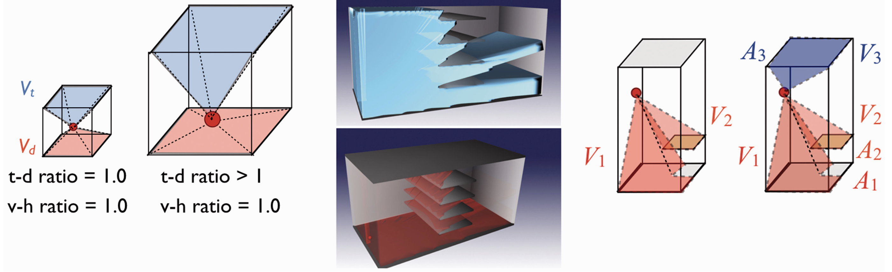

How can psychology aid architecture in improving the usability of buildings? We study how space guides our behaviour, our attention, and our thinking. We design formal measures for architectural computation that are grounded in the cognitive experience of space.

In recent work, we have extended a popular architectural measure of visibility, called an “isovist”, from 2-D to 3-D environments. We demonstrated that our measure better predicts how “spacious” and “complex” a building feels to a human occupant, compared to the previously available methods.

### Articles

#### 2025

  * Krukar, J., and Schultz, C. 2025. "[Ecological validity of architectural cognition: a framework](https://cris.uni-muenster.de/portal/en/publication/133799021)." *Architectural Science Review* 68 (5), 355–362. doi: [10.1080/00038628.2024.2410741](https://dx.doi.org/10.1080/00038628.2024.2410741).

#### 2020

  * Krukar, J., Manivannan, C., Bhatt, M., and Schultz, C. 2020. "[Embodied 3D isovists: A method to model the visual perception of space](https://cris.uni-muenster.de/portal/en/publication/77892102)." *Environment and Planning B* 48 (8), 2307–2325. doi: [10.1177/2399808320974533](https://dx.doi.org/10.1177/2399808320974533).

#### 2018

  * Dalton, R.C., Krukar, J., and Hölscher, C. 2018. "[Architectural cognition and behavior](https://cris.uni-muenster.de/portal/en/publication/61288017)." In *Handbook of Behavioral and Cognitive Geography*. Edward Elgar. doi: [10.4337/9781784717544.00030](https://dx.doi.org/10.4337/9781784717544.00030).