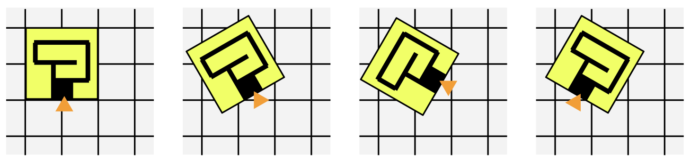

The "In-and-Out" project aims to integrate indoor and outdoor spatial computing with cognitive research. Over the last decade indoor and outdoor spatial computing - previously developed in separation - has been integrated on the technical level. However, cognitive research has not followed this change. For example, wayfinding systems work indoors and outdoors but they do not change the type of support they provide based on the indoor/outdoor context and they do not consider outdoor information that is visible from the inside of the building. Thus, there is a gap between technological capabilities and cognitive understanding in spatial computing. This is critical because the key role of many spatial computing systems is to support cognition of their users, as in the cognitive geoengineering paradigm. This project plans to develop two prototypes: a wayfinding support system and an architectural design support system that for the first time will consider both indoor and outdoor information in an integrated manner. The interdisciplinary approach involves empirical experiments in VR environments and Bayesian statistical modelling.

In the first phase of the project we will develop empirical experiments and collect currently unavailable data on how people's self-localisation is affected by (a) walking across indoor and outdoor spaces, and (b) viewing outdoor information from inside buildings. In the second phase we will implement newly created statistical models in two spatial computing prototypes.

Project Partner: [Prof. Panos Mavros](https://perso.telecom-paristech.fr/pmavros/), Télécom Paris / Institut Polytechnique de Paris

*Funding: [German Research Foundation (Project number 545761511)](https://gepris.dfg.de/gepris/projekt/545761511?language=en) and French National Research Agency; €530k+*